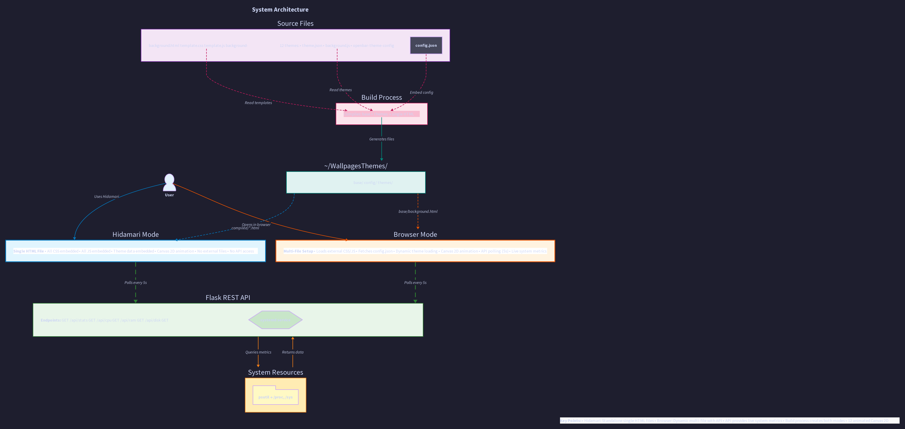

# System Architecture

Complete technical architecture of the Web Desktop Wallpaper system.

## Table of Contents
- [Overview](#overview)
- [System Components](#system-components)
- [Architecture Diagram](#architecture-diagram)
- [Technology Stack](#technology-stack)
- [Data Flow](#data-flow)
- [Directory Structure](#directory-structure)
- [Design Decisions](#design-decisions)

## Overview

The Web Desktop Wallpaper system is a **three-tier client-server application** that displays live system metrics on customizable web-based wallpapers.

**Key Features:**
- Real-time system monitoring (CPU, RAM, Disk, Network)
- 12 animated wallpaper themes
- Flask REST API backend
- Graceful fallback when API unavailable
- Single-file deployments for Hidamari
- GNOME Shell OpenBar integration

## System Components

### 1. Presentation Layer (Frontend)

#### Wallpaper UI
- **Technology**: HTML5, CSS3, Vanilla JavaScript
- **Rendering**: Canvas 2D API for animations
- **Location**: `theme/base/background.html`
- **Features**:
  - Live clock and date display
  - System metrics panels (CPU, RAM, Disk, Network)
  - Theme-specific background animations
  - Configurable center title/image
  - Automatic fallback to randomized data

#### Core JavaScript Modules

**template.js**
- Configuration management
- API polling (5-second intervals)
- UI updates and data formatting
- Theme loading and switching
- Fallback logic

```javascript
// Key APIs
WALLPAPER_TEMPLATE.loadConfig()
WALLPAPER_TEMPLATE.fetchStats()
WALLPAPER_TEMPLATE.setThemeName(name)
WALLPAPER_TEMPLATE.applyTheme(cssVars)
```

**background-manager.js**
- Dynamic script loading for theme backgrounds
- Canvas lifecycle management
- Animation start/stop control

```javascript
// Key APIs
WALLPAPER_BACKGROUND.loadThemeBackground(theme, mode)
WALLPAPER_BACKGROUND.stopBackground()
```

### 2. Application Layer (Backend)

#### Flask REST API
- **Technology**: Python 3, Flask, Flask-CORS
- **Port**: 5000 (default)
- **Deployment**: systemd service
- **Location**: `src/app.py`

**Endpoints:**
- `GET /api/stats` - All metrics in one call (recommended)
- `GET /api/cpu` - CPU usage and cores
- `GET /api/ram` - RAM usage and totals
- `GET /api/disk` - Disk usage and space
- `GET /api/network` - Network I/O statistics
- `GET /api/health` - Health check

**Features:**
- CORS enabled for browser access
- Efficient metric collection via psutil
- JSON responses with numeric values
- Systemd integration for auto-start

### 3. Data Layer

#### System Metrics (psutil)
- **Library**: psutil (Python)
- **Interface**: OS kernel APIs
- **Metrics**:
  - CPU: usage percentage, per-core stats, core count
  - RAM: total, used, available, percentage
  - Disk: total, used, free, percentage
  - Network: bytes sent/received, packets sent/received

### 4. Service Layer

#### systemd Service
- **Service**: `web-wallpaper-api.service`
- **Type**: Simple service
- **Restart**: Always (automatic recovery)
- **User**: Non-root user account
- **Start**: On system boot

**Management:**
```bash
sudo systemctl start web-wallpaper-api
sudo systemctl stop web-wallpaper-api
sudo systemctl restart web-wallpaper-api
sudo systemctl status web-wallpaper-api
```

## Architecture Diagram



### Component Interactions

```
┌─────────────────────────────────────────────────────────┐
│                    User's Desktop                        │
│  ┌───────────────────────────────────────────────────┐  │
│  │     Browser / Hidamari                            │  │
│  │  ┌─────────────────────────────────────────────┐  │  │
│  │  │  Wallpaper UI (HTML/CSS/JS)                 │  │  │
│  │  │  - Clock & Date                             │  │  │
│  │  │  - Metrics Panels                           │  │  │
│  │  │  - Background Animation (Canvas)            │  │  │
│  │  └─────────────────────────────────────────────┘  │  │
│  │           │                         ▲              │  │
│  │           │ Fetch metrics           │ JSON         │  │
│  │           │ (5s interval)           │ response     │  │
│  │           ▼                         │              │  │
│  └───────────────────────────────────────────────────┘  │
└──────────────────│────────────────────────┬─────────────┘
                   │                        │
                   │ HTTP GET /api/stats    │
                   │                        │
┌──────────────────▼────────────────────────┴─────────────┐
│              Flask API (localhost:5000)                  │
│  ┌──────────────────────────────────────────────────┐   │
│  │  app.py                                          │   │
│  │  - Route handlers                                │   │
│  │  - CORS configuration                            │   │
│  │  - JSON serialization                            │   │
│  └──────────────────────────────────────────────────┘   │
│                       │                                  │
│                       │ Call metrics functions           │
│                       ▼                                  │
│  ┌──────────────────────────────────────────────────┐   │
│  │  psutil Library                                  │   │
│  │  - cpu_percent()                                 │   │
│  │  - virtual_memory()                              │   │
│  │  - disk_usage()                                  │   │
│  │  - net_io_counters()                             │   │
│  └──────────────────────────────────────────────────┘   │
│                       │                                  │
└───────────────────────┼──────────────────────────────────┘
                        │
                        │ System calls
                        ▼
                ┌──────────────────┐
                │   OS Kernel      │
                │   - /proc        │
                │   - /sys         │
                │   - syscalls     │
                └──────────────────┘
```

## Technology Stack

| Layer | Component | Technology | Purpose |
|-------|-----------|------------|---------|
| **Frontend** | Wallpaper UI | HTML5, CSS3 | Structure and styling |
| | Animations | Canvas 2D API | Background effects |
| | Logic | Vanilla JavaScript | No framework dependencies |
| **Backend** | API Server | Python 3, Flask | REST API endpoints |
| | Metrics | psutil | System data collection |
| | CORS | flask-cors | Browser access |
| **Service** | Process Manager | systemd | Service lifecycle |
| | Deployment | install.sh | Automated setup |
| **Build** | Compiler | build.sh (bash) | Single-file generation |
| | Templating | jq, sed | Config injection |
| **Desktop** | Shell Extension | OpenBar | Theme integration |
| | Wallpaper Engine | Hidamari | Wallpaper display |

## Data Flow

### Initialization Sequence

```
1. User opens wallpaper (browser or Hidamari)
   ↓
2. Load theme/base/background.html
   ↓
3. Execute template.js
   ↓
4. Load theme/config/config.json
   ↓
5. Determine active theme
   ↓
6. Load theme/{name}/theme.json
   ↓
7. Apply CSS variables to UI
   ↓
8. If backgroundMode present:
   - Load theme/{name}/background.js
   - Initialize canvas animation
   ↓
9. Start API polling loop (5s interval)
```

### Runtime Polling Cycle

```
Every 5 seconds:
  ↓
1. Fetch http://localhost:5000/api/stats
   ↓
2a. SUCCESS:                    2b. FAILURE:
    - Parse JSON response           - Use randomized values
    - Update UI panels              - Show "RANDOMIZED" status
    - Set status indicators         - Continue polling
    - Set status to "ONLINE"
   ↓
3. Schedule next poll in 5 seconds
```

### Theme Switching

```
User switches theme:
  ↓
1. Stop current background animation
   ↓
2. Load new theme/{name}/theme.json
   ↓
3. Apply new CSS variables
   ↓
4. If new backgroundMode:
   - Load new background.js
   - Start new animation
   ↓
5. Update UI with new colors
```

## Directory Structure

```
web-desktop-wallpapers/
├── theme/                          # Theme files
│   ├── base/                       # Base templates
│   │   ├── background.html         # Main HTML template
│   │   ├── template.css            # Base styles
│   │   ├── template.js             # Core logic
│   │   └── background-manager.js   # Animation loader
│   │
│   ├── config/                     # Configuration
│   │   └── config.json             # Global settings
│   │
│   └── themes/                     # All theme implementations
│       ├── matrix-green-blue/      # Example theme
│       │   ├── theme.json          # Theme colors & mode
│       │   ├── background.js       # Custom animation
│       │   └── openbar-theme-config  # Shell colors
│       │
│       └── [11 other themes]/      # Additional themes
│
├── src/                            # Backend API
│   ├── app.py                      # Flask application
│   └── utils/
│       └── system_metrics.py       # Metric helpers
│
├── docs/                           # Documentation
│   ├── getting-started/            # User guides
│   ├── architecture/               # This document
│   ├── development/                # Dev guides
│   └── themes/                     # Theme creation
│
├── build.sh                        # Single-file compiler
├── install.sh                      # Service installer
├── web-wallpaper-api.service       # systemd unit
├── requirements.txt                # Python dependencies
├── docker-compose.yml              # Docker setup
└── README.md                       # Project overview
```

### Installed Structure (User Home)

```
~/WallpagesThemes/                 # Installed by install.sh
├── base/                          # Base templates
├── config/                        # Configuration
├── themes/                        # All theme implementations
│   ├── matrix-green-blue/         # Themes (all 12)
│   └── [other themes]/
├── compiled/                      # Built wallpapers (single-file HTML)
│   ├── wallpaper-matrix-green-blue.html
│   └── [other wallpaper files]
└── build.sh                       # Build script
```

## Design Decisions

### 1. Three-Tier Architecture
**Decision**: Separate presentation, application, and data layers

**Rationale**:
- Clean separation of concerns
- Independent scaling and testing
- Technology flexibility per layer
- Easy to add new frontends or backends

### 2. Polling vs WebSockets
**Decision**: 5-second HTTP polling for metrics

**Rationale**:
- Simpler implementation (no WebSocket server)
- Sufficient for non-critical metrics
- Lower server resource usage
- Easier firewall/proxy traversal
- Graceful degradation on network issues

### 3. Vanilla JavaScript (No Framework)
**Decision**: No React/Vue/Angular

**Rationale**:
- Zero dependencies for frontend
- Faster load time
- Smaller file size
- No build step required for development
- Direct DOM manipulation is sufficient

### 4. Single-File Wallpapers
**Decision**: Compile to standalone HTML files

**Rationale**:
- Easy distribution and sharing
- No relative path issues
- Works with Hidamari directly
- Self-contained (no external dependencies)
- Offline capable

### 5. Theme File Structure
**Decision**: One folder per theme with theme.json + optional background.js

**Rationale**:
- Easy to add new themes
- Clear organization
- Theme-specific code isolation
- Dynamic loading at runtime
- No recompilation for theme changes

### 6. Graceful API Fallback
**Decision**: Show randomized data when API unavailable

**Rationale**:
- Wallpaper always functional
- User can see UI/theme design
- Clear indication of "fake" data
- Automatic recovery when API returns
- Better UX than error messages

### 7. systemd Service
**Decision**: Run Flask API as system service

**Rationale**:
- Auto-start on boot
- Automatic restart on crash
- Standard Linux service management
- Proper logging via journald
- User-level isolation

### 8. OpenBar Integration
**Decision**: Provide per-theme shell color configs

**Rationale**:
- Cohesive desktop aesthetic
- Automated shell theming
- Matches wallpaper colors
- Optional feature (doesn't require OpenBar)

### 9. Canvas 2D API for Animations
**Decision**: Use Canvas instead of WebGL/CSS animations

**Rationale**:
- Simpler API
- Better CPU efficiency for 2D graphics
- No GPU requirements
- Wider browser compatibility
- Sufficient for current animation complexity

### 10. Config-Driven Design
**Decision**: JSON configuration for all settings

**Rationale**:
- No code changes for config updates
- Easy user customization
- Machine-readable and editable
- Schema validation possible
- Portable between environments

## Security Considerations

### API Security
- **Exposure**: Binds to localhost by default
- **Authentication**: None (localhost trust)
- **Data**: Read-only system metrics
- **Risk**: Low (local access only)

**For Remote Access:**
- Add authentication middleware
- Use HTTPS with proper certificates
- Implement rate limiting
- Whitelist allowed clients
- Consider VPN for secure tunnel

### File System Security
- **Install Path**: User home directory
- **Permissions**: User-owned files
- **Service**: Runs as non-root user
- **Execution**: No elevated privileges

### Browser Security
- **CORS**: Enabled for localhost
- **Content**: Static HTML/JS/CSS
- **Execution**: Sandboxed in browser
- **Network**: Outbound only to localhost API

## Performance Characteristics

### Frontend
- **Load Time**: < 500ms (single HTML file)
- **Memory**: ~50-100 MB (browser process)
- **CPU**: Varies by animation (5-15% typical)
- **Network**: 5-second polling (~1 KB per request)

### Backend
- **Memory**: ~30-50 MB (Python + Flask)
- **CPU**: < 1% (metric collection)
- **Response Time**: < 10ms per request
- **Concurrency**: 1 client (wallpaper)

### Optimizations Applied
- Single `/api/stats` endpoint (reduce HTTP overhead)
- Canvas opacity controls animation impact
- requestAnimationFrame for smooth 60 FPS
- Particle count limits per theme
- Minimal DOM manipulation
- CSS variables for theme switching (no repaint)

## Scalability Considerations

### Current Design Limitations
- Single-user system (localhost)
- No caching layer
- No database (stateless)
- Polling-based (not push)

### Future Enhancements
- Redis caching for metrics
- WebSocket for real-time updates
- Multi-tenant support with auth
- Metrics history storage
- Alerting and notifications
- Plugin system for custom metrics

## Related Documentation

- [Communication Flow](diagrams/communication-flow.png) - Detailed sequence diagrams
- [API Documentation](../development/api.md) - REST API reference
- [Theme Development](../development/themes.md) - Creating themes
- [Installation Guide](../getting-started/installation.md) - Setup instructions
